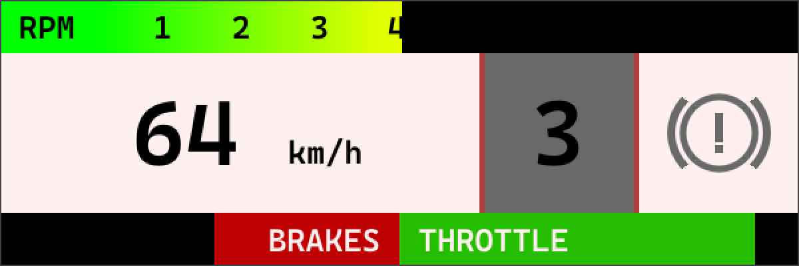

# Dirt-Display

A simple Dirt Rally 2.0 telemetry display tool, use the style from WRC tv overlay style.



# Intro
It cant display basic informations using the game's UDP data(mode 3), suck as:

- RPM
- Speed (provided by UDP data, which I think is more accurate than the speed display in game)
- gear
- handbrake status (not provided by the game directly, and the detection is not perfect at the moment, but most of the time it should be correct)
- brake/throttle input


# How to Build

### Deps
- Boost
- CMake

### Build
Simple CMake project, should be easy.

The switch ```ENABLE_MULTICAST``` can be set to cooperate with a simple UDP data relay, see another project **dirt-relay**


# How to Use

- Standalone version(no ENABLE_MULTICAST set), set the game to send UDP packet to port 31000
- Multicast version, see the cmd parameters